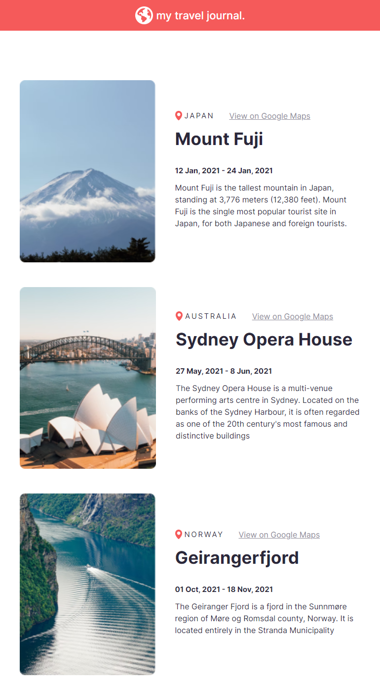

# Solo project 2

a small project about travel journal which is contain a few place that is visited.

provide a pic of each place, location and a small paragraph 

 

### start up 
_firstly installation_
there two ways to install the dependencies
* `npm install` 
* `yarn`

_secondly run the app_
two ways as to run the app: 
* `npm start`
* `yarn start`
